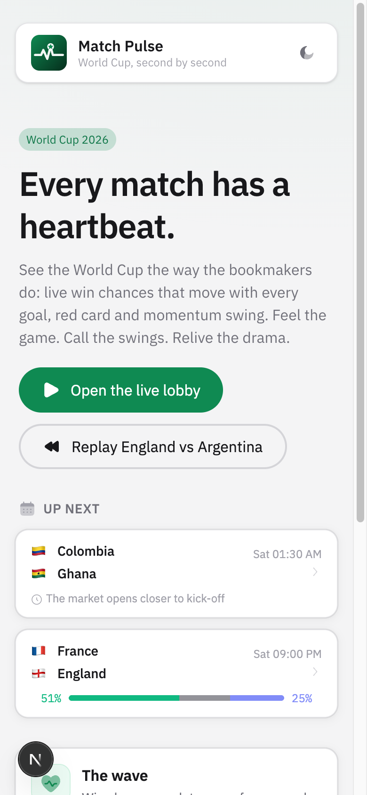
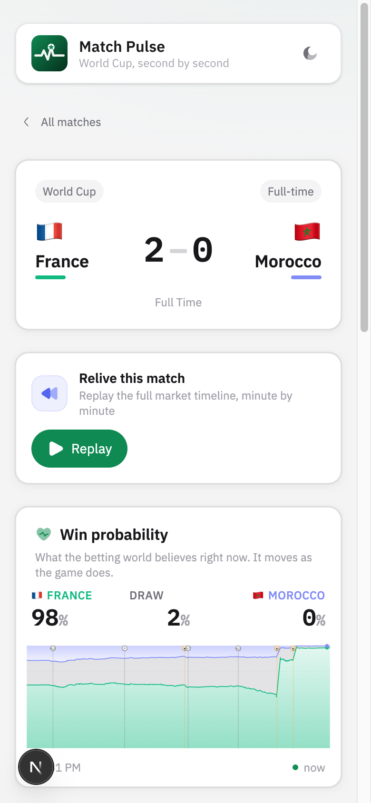
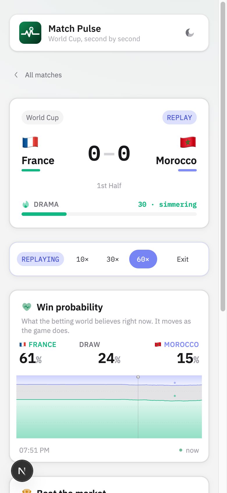

# Torq

A live World Cup second-screen app built on TxLINE consensus odds and the TxOracle program on Solana.

Fans open Torq on their phone during a match and watch the game’s heartbeat: a live win-probability river from the same demargined odds bookmakers trade on, moments from market movement, a skill prediction game scored against the real feed, full match replays after the whistle, and one-tap on-chain scoreline proof. No betting, no sign-up, no crypto knowledge required.

**Live MVP:** https://fervor.up.railway.app  
**Repo:** https://github.com/fozagtx/fervor  
**Track:** TxODDS · Consumer & Fan Experiences (World Cup)

> **Originality:** First second-screen that combines consensus-odds **Drama Score** + a playable **Beat the Market** mini-game + **verifiable on-chain outcomes** — without requiring betting.

## How It Works

1. **Subscription:** the server obtains a guest JWT, sends a `subscribe` transaction to the TxLINE program on Solana devnet (free World Cup tier), signs activation, and receives a long-lived API token. Fans never touch any of this.
2. **Ingestion:** a single hub consumes TxLINE odds + scores SSE streams, normalizes match state, and records every message to disk.
3. **The wave:** full-match `1X2_PARTICIPANT_RESULT` consensus odds become win probabilities from the feed’s demargined `Pct` field and stream to every browser over one SSE endpoint.
4. **Moments:** goals, cards, VAR, and penalties come from the scores feed; significant odds movement is detected as “market shift” moments — often before TV commentary reacts.
5. **Beat the Market:** fans call a team’s win chance higher or lower over the next five match-minutes; calls settle against the live feed with points and streak multipliers.
6. **Replay:** finished matches re-stream through the identical pipeline at 10× / 30× / 60× from recorded or backfilled history.
7. **Proof:** one tap fetches Merkle proofs from TxLINE and has TxOracle verify the fixture and exact final scoreline as read-only simulations.

## Drama Score

```
Drama = MarketVolatility(0–60) + EventSpikes(0–45, capped) + Closeness(0–10), capped at 100
```

- **Market volatility:** recency-weighted sum of win-probability movement over the last 10 minutes.
- **Event spikes:** goals, disallowed goals, penalties, red cards, and market shifts each add heat that decays over 8 minutes.
- **Closeness:** a tight three-way market raises the floor.

The score ranks the lobby (“which game should I be watching?”) and feeds the full-time recap alongside the biggest five-minute market swing.

Full product notes: [`docs/submission.md`](docs/submission.md) · UX context: [`docs/ux-context-profile.md`](docs/ux-context-profile.md)

## Tech Stack

| Layer | Technology |
|---|---|
| Frontend | Next.js 16, React 19, TypeScript |
| UI | HeroUI, Tailwind CSS v4, Framer Motion, custom SVG charting |
| Data | TxLINE off-chain API (odds/scores SSE, snapshots, historical archive, validation proofs) |
| Chain | Solana devnet, `@coral-xyz/anchor`, TxOracle (`validateFixture`, `validateStatV2`) |
| Wallet | Optional Phantom connect (identity only — no transactions) |
| Native | macOS Dynamic Island companion (`macos/`) |
| Hosting | Railway (persistent Node process + volume for feed recordings) |

## Screenshots

### Landing

Landing page — brand, heartbeat pitch, enter the live lobby.



### Match lobby

TikTok-style reel of live and upcoming World Cup fixtures with drama and win-prob strip.


### Finished match — full story

Wave chart, moments, Beat the Market record, and full-time recap.



### Replay at 60×

Same pipeline as live — scrub the market’s heartbeat after the whistle.



## Quick Start

### Prerequisites

- Node.js 20+
- pnpm
- A Solana devnet wallet keypair with a little SOL (only for the one-time subscribe transaction), **or** pre-activated TxLINE credentials

### Setup

```bash
pnpm install

# Option A: full flow — wallet signs the on-chain subscription at boot
export TXLINE_WALLET_PATH=_keys/wallet.json
pnpm bootstrap        # subscribe → activate → verify streams

# Option B: pre-activated credentials (what production uses;
# the signing wallet never leaves your machine)
export TXLINE_JWT=...
export TXLINE_API_TOKEN=...

pnpm dev
```

App: http://localhost:3000

### Environment variables

| Variable | Purpose |
|---|---|
| `TXLINE_NETWORK` | `devnet` (default) or `mainnet` |
| `TXLINE_WALLET_PATH` / `TXLINE_WALLET_SECRET` | keypair for the subscribe transaction |
| `TXLINE_JWT` + `TXLINE_API_TOKEN` | pre-activated credentials (skips wallet) |
| `SOLANA_RPC_URL` | RPC endpoint (defaults to public devnet) |

### Try the live app

| Step | URL |
|---|---|
| Open the app | https://fervor.up.railway.app |
| Match lobby | https://fervor.up.railway.app/matches |
| Moments feed | https://fervor.up.railway.app/feed |
| Leaderboard | https://fervor.up.railway.app/leaders |
| Live smoke check | `pnpm smoke` |

### Build the macOS island

```bash
./macos/build.sh
open macos/dist/Torq.app   # unsigned: right-click → Open on first launch
```

## Key Features

- **Win-probability river:** live three-band chart (home / draw / away) with goals, VAR, penalties, and market shifts pinned to the timeline.
- **Drama meter:** 0–100 “how crazy is this match right now” on every live card and match header.
- **Market-shift moments:** narrates when the money moves (“France surging +8pp”) before TV catches up.
- **Beat the Market:** higher/lower calls settled against the real odds stream; streaks and shareable record — skill game, no wagering.
- **Who wins crowd + FOMO ticker:** light social layer without sportsbook copy.
- **Replay engine:** per-viewer replays at 10× / 30× / 60× through the same pipeline as live.
- **Full-time recap:** drama peak, biggest five-minute swing, goals, your call record, one-tap share.
- **Pundit voice:** optional speech-synthesis narration with market context in every line.
- **Provably real scorelines:** TxOracle view simulations for fixture + exact final score.
- **Guest by default:** zero crypto friction; Phantom optional for identity only.
- **PWA + mobile-first:** installable Add to Home Screen; vertical reel lobby; large tap targets.
- **macOS Dynamic Island:** native notch companion with live score, win-prob bar, mute, click-through when idle.
- **Streamer embed:** `/embed/[fixtureId]` for OBS / Twitch overlays.
- **Watch with me:** `/watch/[fixtureId]` deep links that sync followed teams.
- **Restart-proof hub:** disk rehydrate, stream watchdog, bundled seed recordings for cold boots.

## API

Fan-facing and hub endpoints:

| Endpoint | Purpose |
|---|---|
| `GET /api/stream` | SSE: init snapshot + live increments for all matches |
| `GET /api/stream?fixture={id}` | SSE scoped to one match |
| `GET /api/stream?fixture={id}&replay=1&speed={n}` | per-connection replay session |
| `GET /api/matches` | current lobby state |
| `GET /api/history/{fixtureId}` | full recorded history of a finished match |
| `GET /api/verify/{fixtureId}` | on-chain fixture + scoreline proof (view simulation) |
| `GET /api/follows?id=` / `PUT /api/follows` | island ↔ web followed-team sync |
| `GET/POST /api/who-wins` | crowd “who wins” tallies |
| `GET /api/leaderboard` | Beat the Market standings |

### TxLINE endpoints used (upstream)

- `POST /auth/guest/start`
- `POST /api/token/activate`
- `GET /api/fixtures/snapshot`
- `GET /api/odds/stream` (SSE) · `GET /api/scores/stream` (SSE)
- `GET /api/odds/snapshot/{fixtureId}` · `GET /api/scores/historical/{fixtureId}`
- `GET /api/odds/updates/{epochDay}/{hourOfDay}/{interval}`
- `GET /api/fixtures/validation` + on-chain `validateFixture`
- `GET /api/scores/stat-validation` + on-chain `validateStatV2`

API experience / friction notes: [`docs/submission.md`](docs/submission.md#api-feedback)

## Project Structure

```
fervor/
├── app/
│   ├── page.tsx                 # Landing
│   ├── matches/                 # TikTok-style lobby reel
│   ├── match/[id]/              # Full match screen
│   ├── feed/                    # Moments feed
│   ├── leaders/                 # Beat the Market leaderboard
│   ├── watch/[id]/              # Watch-with-me deep link
│   ├── embed/[id]/              # Streamer / TV embed
│   ├── mini/[id]/               # Floating mini scoreboard
│   └── api/                     # stream, matches, history, verify, follows, …
├── components/                  # WaveChart, MatchReel, MarketSlip, PredictCard,
│                                # GoalBlast, RecapCard, DramaMeter, ProofBadge, …
├── lib/
│   ├── txline/                  # config, auth, api, hub, normalize, replay, types
│   ├── drama.ts                 # drama score + biggest swing
│   ├── stats.ts                 # call-record storage (guest / wallet)
│   ├── share.ts                 # watch links + share cards
│   └── useMatchStream.ts        # client SSE hook
├── macos/                       # Native Dynamic Island (Swift)
├── idl/                         # TxOracle IDL + types
├── scripts/                     # bootstrap, smoke-live
├── seed-recordings/             # bundled real feed history
└── docs/                        # submission, UX / product context, screenshots
```

## Documentation

| Document | Description |
|---|---|
| [Submission Notes](docs/submission.md) | Product highlights, TxLINE endpoints used, API feedback, Earn form paste block |
| [Product Engineering Context](docs/product-engineering-context.md) | Identity, gaps, demo golden path |
| [UX Context Profile](docs/ux-context-profile.md) | Fan language, TikTok × SportyBet north star |
| [Demo Script](claudedocs/demo-script.md) | 5-minute recording spine for judges |
| [TxLINE Quickstart](https://txline.txodds.com/documentation/quickstart) | Upstream data platform |

---

## World Cup Track Submission

Copy-paste fields for the **TxODDS Consumer & Fan Experiences** Earn challenge.  
X / Tweet / social links omitted (we don’t have them).

| Field | Value |
|---|---|
| **Link to Your Submission** | https://fervor.up.railway.app |
| **Project Title** | Torq |
| **Live & working MVP** | https://fervor.up.railway.app |
| **Live Demo Video** | _TBD — record & paste Loom/YouTube URL here_ (script: [`claudedocs/demo-script.md`](claudedocs/demo-script.md)) |
| **Public Repository** | https://github.com/fozagtx/fervor |
| **Technical Documentation** | https://github.com/fozagtx/fervor/blob/main/README.md · [`docs/submission.md`](docs/submission.md) |

### Briefly explain your Project

Torq is a World Cup second-screen app for fans with a phone in hand. It turns TxLINE consensus odds into a live win-probability “wave,” drama ranking, Beat-the-market skill calls (no wagering), GoalBlast moments, full match replay, a macOS Dynamic Island companion, and one-tap on-chain scoreline proof via TxOracle — so the market’s heartbeat is something you can feel, not a sportsbook.

**Originality for judges:** First second-screen that combines consensus odds Drama Score + a playable mini-game + verifiable outcomes without requiring betting.

### Share your team's experience using the TxLINE API

**Liked most**
- The demargined `Pct` field — a consumer win-probability product with zero odds math
- Free World Cup tier + real on-chain `subscribe` / activation flow worked as documented
- No rate limiting made historical odds backfill painless
- Runnable devnet examples got auth working in the first hour

**Friction**
- Spec vs feed casing: OpenAPI camelCase vs live/historical PascalCase (`FixtureId`, `GameState`, …)
- Top-level `GameState` stayed “scheduled” through finished matches — real state is in `StatusId`
- Period filters inconsistent (`MarketParameters` live vs `MarketPeriod` archive)
- `/api/token/activate` returns `text/plain`; `/scores/historical` uses SSE-style `data:` framing on a plain GET

Full write-up: [`docs/submission.md`](docs/submission.md) → *API feedback*.

### Anything Else?

- macOS notch companion: `macos/` → `./macos/build.sh`
- Streamer embed: `https://fervor.up.railway.app/embed/[fixtureId]`
- Watch-with-me: `/watch/[fixtureId]`
- Live smoke: `pnpm smoke`

### Confirmation (form checkbox)

I confirm that I have reviewed the scope of this track and that my submission adheres to the specified requirements.  
**Track:** Consumer & Fan Experiences — phone-in-hand World Cup fan product on TxLINE live scores / odds / events (not a trading agent or sportsbook).

## License

MIT
