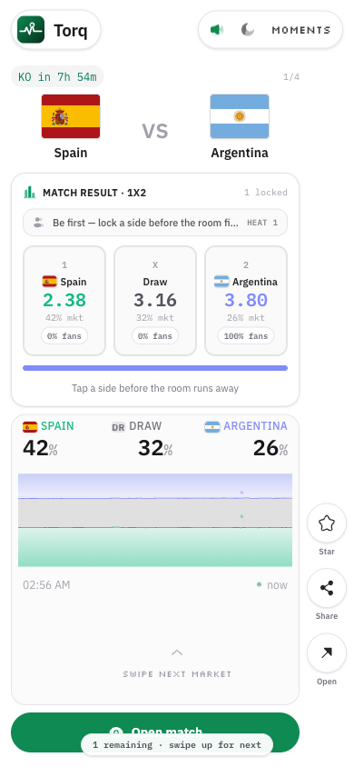
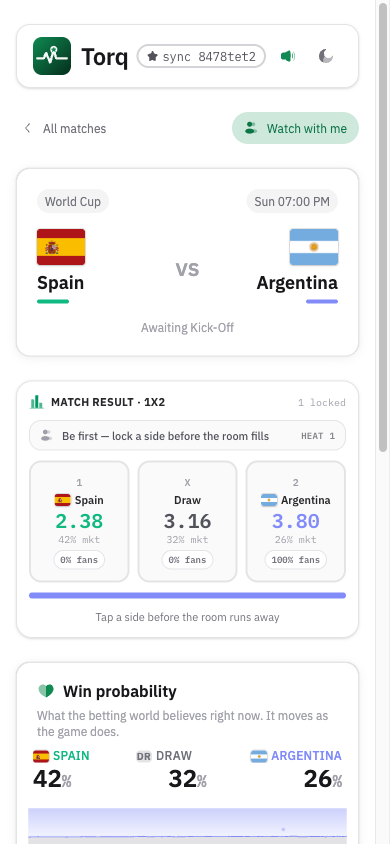
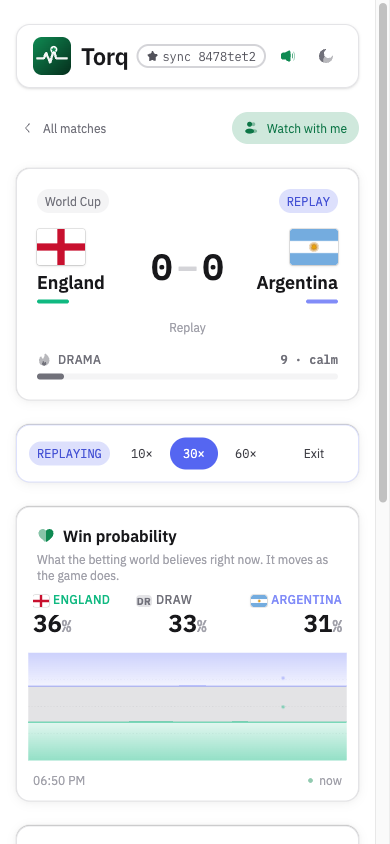
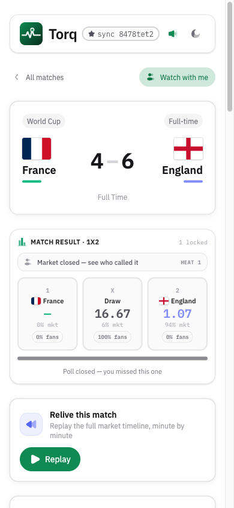

# Torq

World Cup second screen on [TxLINE](https://txline.txodds.com) consensus odds and Solana **TxOracle**, plus a **macOS Dynamic Island / notch** companion for live scores and win%.

Watch the win-probability **wave**, **Drama Score**, market-shift moments, **Beat the Market** skill calls, full match replays, and one-tap on-chain score proof. Free to open. Guest mode by default. Wallet optional for identity.

| | |
|---|---|
| **App** | https://torq.up.railway.app |
| **Mac notch (DMG)** | [Download Torq.dmg](https://github.com/fozagtx/fervor/releases/download/torq-mac/Torq.dmg) |
| **Repo** | https://github.com/fozagtx/fervor |
| **Track** | TxODDS · Consumer & Fan Experiences |

> Consensus-odds Drama Score, a playable mini-game, and verifiable outcomes in one fan app. Ships with a native **Mac notch** companion.

## How It Works

1. **Server auth** - guest JWT → on-chain `subscribe` → API token (handled server-side).
2. **Hub** - TxLINE odds + scores SSE → normalize, record, fan out over one browser SSE.
3. **Wave** - demargined `Pct` → live home/draw/away win %.
4. **Play** - Beat the Market calls settle against the feed; moments + GoalBlast on big moves.
5. **Replay / proof** - same pipeline at 10×–60×; TxOracle verifies fixture + final score.

TxLINE endpoints + API feedback → [`docs/txline.md`](docs/txline.md)

## Tech Stack

| Layer | Technology |
|---|---|
| App | Next.js 16, React 19, TypeScript, HeroUI, Tailwind |
| Data | TxLINE SSE / snapshots / history / validation proofs |
| Chain | Solana devnet, Anchor, TxOracle (`validateFixture`, `validateStatV2`) |
| Wallet | Optional Phantom (identity only) |
| Native | macOS Dynamic Island (`macos/`) |
| Host | Railway |

## Screenshots

<p align="center">
  
  
  
  
</p>

| Feed | Match | Replay | Full-time |
|---|---|---|---|
| Home market reel | 1X2 + wave | 10x/30x/60x | FT recap + Replay |

## Quick Start

```bash
pnpm install
export TXLINE_JWT=...          # or TXLINE_WALLET_PATH + pnpm bootstrap
export TXLINE_API_TOKEN=...
pnpm dev                       # http://localhost:3000
```

Live smoke: `pnpm smoke`

## Mac notch companion

Native **macOS Dynamic Island / menu-bar notch** app. Same live TxLINE feed as the site: scores, win%, expand on hover.

| | |
|---|---|
| **Download** | [Torq.dmg](https://github.com/fozagtx/fervor/releases/download/torq-mac/Torq.dmg) |
| **Install** | Open DMG → drag Torq to Applications → right-click → Open |
| **Docs** | [`macos/README.md`](macos/README.md) |
| **Build** | `./macos/build.sh && open macos/dist/Torq.app` |

## Key Features

- Win-probability river + Drama Score + market-shift moments  
- Beat the Market streaks · Who wins crowd · Moments feed  
- Replay 10×/30×/60× · Pundit TTS · FT recap + share  
- On-chain score proof · PWA · `/embed` · `/watch`  
- **macOS Dynamic Island / notch companion** (DMG above)  

## Docs

| Doc | What’s in it |
|---|---|
| [TxLINE integration](docs/txline.md) | Endpoints used + Earn API feedback |
| [Mac notch install](macos/README.md) | DMG download + island setup |
| [Submission / Earn paste](docs/submission.md) | Form answers, product notes |
| [Demo script](docs/demo-script.md) | 5-min recording spine |
| [UX context](docs/ux-context-profile.md) | Fan language / north star |

## License

MIT
